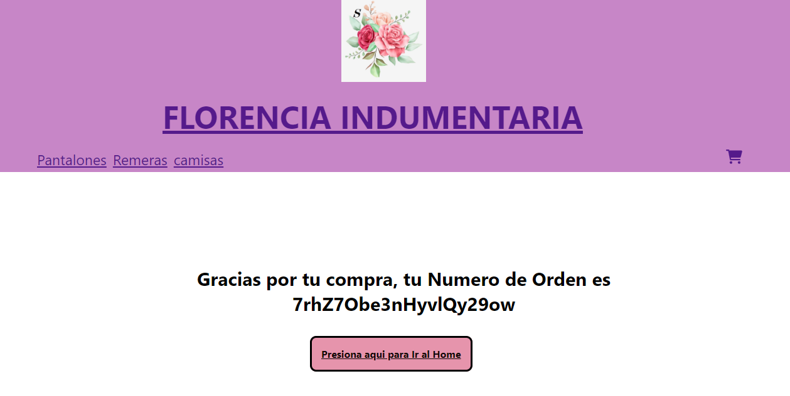

#
<h1 align="center"> Florencia Indumentaria </h1>

  

 ### :page_with_curl: Descripción del Proyecto

 He realizado una pagina comercial de venta de ropa donde se pueden obtener articulos por medio de una compra a traves de un carrito de compras, implementando lo aprendido durante el curso React.

### :bulb: Que es un carrito

Un carrito de compras es un software que facilita a los consumidores la compra de algún producto o servicio al aceptar el pedido y el pago correspondiente en pocos pasos.

  

## :bookmark_tabs: Instrucciones para la utilizacion del carrito

- El usuario debe abrir la página donde está implementada el carrito de compras y comenzar su utilización, la aplicación expone varios productos con descripciones y fotografías de los productos disponibles.
- El usuario puede consultar la disponibilidad de un producto, esto se hace con el botón "detalle" que esta asociado a cada ítem.
- Si el cliente esta interesado en algún producto debe seleccionar la cantidad de unidades de éste que desee, por defecto la cantidad es 1, y presionar el botón "Agregar al carrito" que agrega la cantidad especificada de ese producto al carrito de compras. 
- Una vez que el cliente ya agregó todos los productos que desee, se debe revisar el estado de la compra, seleccionando el ícono del carrito ubicado en el extremo superior derecho de la aplicación o botón "ir al carrito". Es en este ítem donde se especifican los productos que el cliente ha seleccionado, destacando el precio de cada unidad y el valor total de la compra.
-  Si el cliente está conforme se procede a concretar la compra, presionando el boton "Checkout" , ubicado en la parte inferior de la descripción de la misma. Esta acción lo llevará a un formulario donde el usuario debe ingresar sus datos para realizar el envío del o los productos adquiridos y finalmente presionar "enviar" para obtener una confirmación y número de orden.



### :heavy_check_mark: Librerías utilizadas
- React-router-dom
- [Firebase](https://firebase.google.com)


### :open_file_folder: Acceso al proyecto

1  Clonar repositorio
```
https://github.com/DeboEliza/SegundaEntrega.git
```
2  abrir en tu editor de código

3  instalar las dependencias con el comando

```
npm install
```
4 Una vez instalado puedes correrlo con el comando
```
mpn start
```
## Estado del Proyecto

<p align="left">
   
   </p>

### :gift: Agradecimientos 

- Saludos Profesor Eric Waje de CoderHouse
- Saludos tutores de CoderHouse


